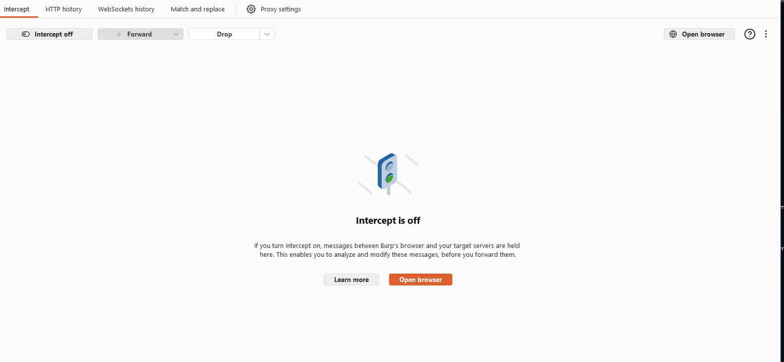
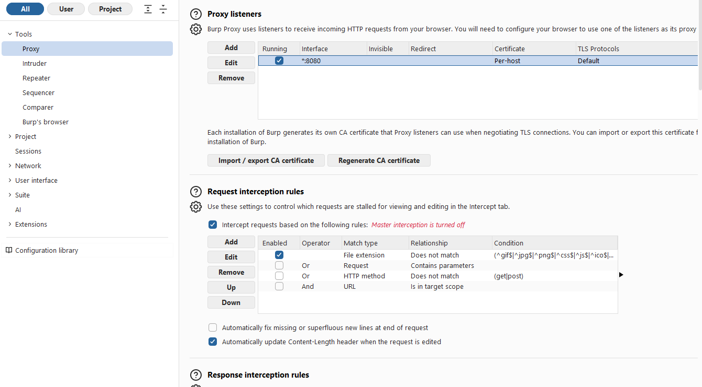
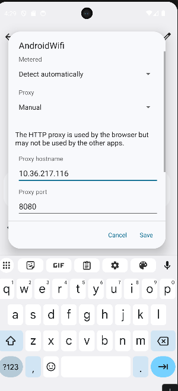
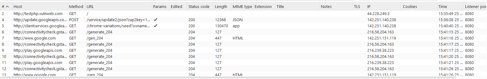
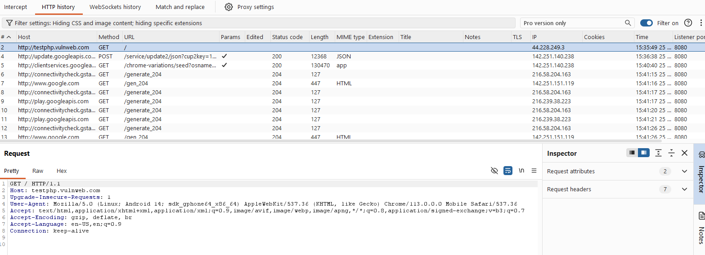
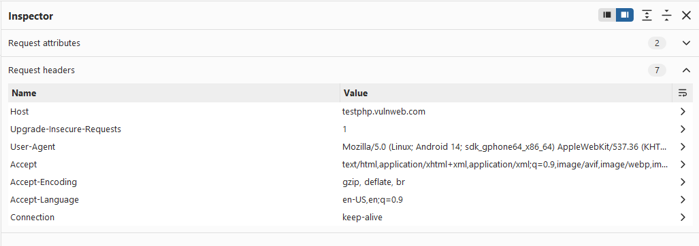
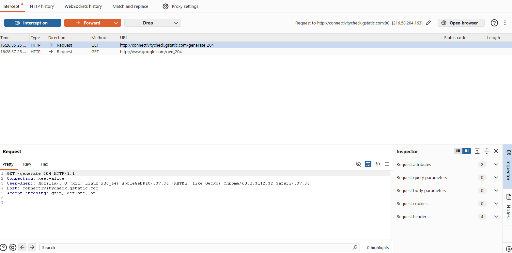
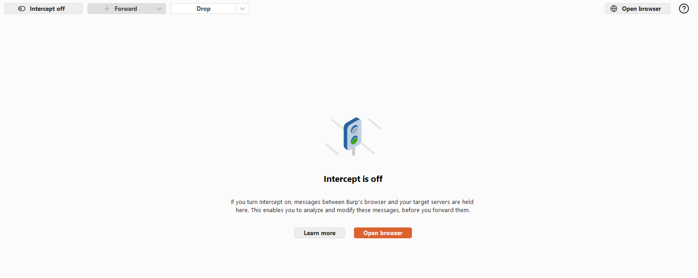
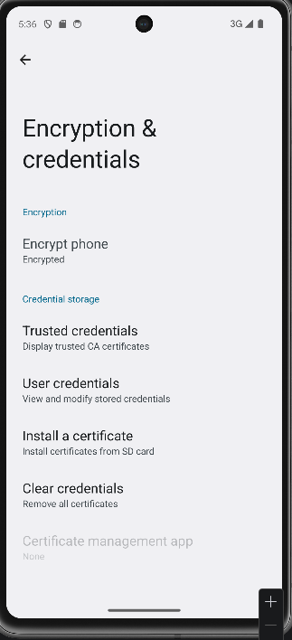

# 🔍 LAB 3 — Observation du trafic HTTP(S) Android avec Burp Suite

> **Cours** : Sécurité des applications mobiles  
> **Environnement** : Android Emulator (Pixel 7 - Android 14) + Burp Suite Community v2026.4.3  
> **Date** : 25/05/2026

---

## 📋 Table des matières

1. [Vue d'ensemble](#-vue-densemble)
2. [Objectifs pédagogiques](#-objectifs-pédagogiques)
3. [Prérequis](#-prérequis)
4. [Règles de sécurité](#-règles-de-sécurité-obligatoires)
5. [Étapes du lab](#-étapes-du-lab)
6. [Checkpoints de validation](#-checkpoints-de-validation)
7. [Mini-rapport d'audit](#-mini-rapport-daudit)
8. [Nettoyage fin de lab](#-fin-de-lab--nettoyage)

---

## 🌐 Vue d'ensemble

Ce lab met en place un **proxy d'observation** entre un Android Emulator et une application cible autorisée.

```
[Android Emulator - Pixel 7]
           │
           │  trafic HTTP
           ▼
[Burp Suite Proxy - 10.0.2.2:8080]
           │
           │  trafic relayé
           ▼
  [http://testphp.vulnweb.com]
```

---

## 🎯 Objectifs pédagogiques

| # | Objectif |
|---|----------|
| 1 | Vérifier qu'un navigateur Android envoie son trafic via Burp |
| 2 | Identifier les éléments essentiels d'une requête (URL, méthode, headers, cookies) |
| 3 | Expliquer la différence HTTP vs HTTPS et le rôle d'un certificat CA |
| 4 | Produire une trace d'audit simple (preuves + contexte) |

---

## 🛠 Prérequis

- [x] **Burp Suite Community v2026.4.3** installé sur la machine hôte
- [x] **Android Emulator Pixel 7 (Android 14)** fonctionnel via Android Studio
- [x] Cible autorisée : `http://testphp.vulnweb.com`

---

## 🔒 Règles de sécurité (obligatoires)

- ✅ Trafic intercepté **uniquement pour des cibles autorisées**
- ❌ Aucun compte personnel, aucune donnée sensible
- 🗑️ Proxy et certificat retirés à la fin de la séance

---

## 📋 Étapes du lab

---

### Étape 1 — Préparer Burp Suite (projet et mode Proxy)

Lancer Burp Suite → Temporary project → onglet **Proxy** → vérifier que **"Intercept is off"**.

> 💡 Un proxy d'observation ne doit pas bloquer le trafic tant que la configuration n'est pas validée.



---

### Étape 2 — Vérifier le Proxy Listener

Proxy settings → Proxy listeners → modifier le listener de `127.0.0.1:8080` vers **`*:8080` (All interfaces)** pour que l'émulateur puisse joindre Burp.

> ⚠️ Si le listener est limité à loopback only, l'émulateur ne peut pas l'atteindre.



---

### Étape 3 — Identifier l'adresse réseau de la machine hôte

Dans le contexte de l'émulateur Android, l'adresse spéciale pour joindre la machine hôte est :

```
10.0.2.2
```

> 💡 `10.0.2.2` est l'adresse "magique" de l'émulateur Android qui pointe vers `localhost` de la machine hôte — plus fiable que l'IP Wi-Fi réelle.

---

### Étape 4 — Configurer le proxy côté Android Emulator

Settings → Network & Internet → Internet → ⚙️ AndroidWifi → Edit → Advanced options → **Proxy: Manual**

| Paramètre | Valeur |
|-----------|--------|
| Proxy hostname | `10.0.2.2` |
| Proxy port | `8080` |




---

### Étape 5 — Premier test : capturer du HTTP

Ouvrir Chrome sur l'émulateur → naviguer vers `http://testphp.vulnweb.com` → vérifier dans Burp **HTTP history** qu'au moins une requête apparaît.



---

### Étape 6 — Lire une requête comme un analyste

Sélectionner la requête `GET /` vers `testphp.vulnweb.com` → observer la vue **Raw** puis le panneau **Inspector**.

**Vue Raw :**

```
GET / HTTP/1.1
Host: testphp.vulnweb.com
Upgrade-Insecure-Requests: 1
User-Agent: Mozilla/5.0 (Linux; Android 14; sdk_gphone64_x86_64) AppleWebKit/537.36
Accept: text/html,application/xhtml+xml,...
Accept-Encoding: gzip, deflate, br
Accept-Language: en-US,en;q=0.9
Connection: keep-alive
```



**Panneau Inspector — Headers structurés :**



---

### Étape 7 — Interception contrôlée (mode pédagogique)

Activer **"Intercept on"** → rafraîchir Chrome → observer la requête **bloquée** dans Burp → désactiver immédiatement.





---

### Étape 8 — HTTPS en laboratoire : principe du certificat CA

Settings → Security → Encryption & credentials → observer les types de certificats disponibles.

> ⚠️ En labo, un certificat CA Burp peut être installé **uniquement sur l'émulateur** et **retiré à la fin**.



**Principe HTTPS avec proxy :**

```
Sans certificat CA :
  Chrome → ❌ [TLS warning] → Burp refusé

Avec certificat CA de labo (émulateur uniquement) :
  Chrome → ✅ → Burp déchiffre → relaye vers cible
```

---

## ✅ Checkpoints de validation

- [x] **CP1** — Burp capture au moins une requête dans HTTP history
- [x] **CP2** — Proxy listener actif sur `*:8080` (All interfaces)
- [x] **CP3** — Proxy Android en Manual avec `10.0.2.2:8080`
- [x] **CP4** — Intercept utilisé pour démonstration, puis désactivé
- [x] **CP5** — Rapport court produit (preuve + contexte)
- [x] **CP6** — Nettoyage de fin de séance prévu

---

## 📄 Mini-rapport d'audit

### Périmètre
- Émulateur : Pixel 7, Android 14 (UpsideDownCake)
- Cible autorisée : `http://testphp.vulnweb.com`
- Aucune donnée personnelle en transit

### Configuration
| Paramètre | Valeur |
|-----------|--------|
| Burp Suite | v2026.4.3 Community |
| Adresse proxy | `10.0.2.2` |
| Port proxy | `8080` |
| Date | 25/05/2026 |

### Observations
- Requêtes HTTP capturées en clair dans Burp HTTP history
- `User-Agent` Android 14 clairement identifiable dans les headers
- Aucun cookie de session présent sur `testphp.vulnweb.com` (première visite)
- Header `Upgrade-Insecure-Requests: 1` présent — le navigateur tente de passer en HTTPS

### Risques observés
| Risque | Niveau |
|--------|--------|
| Trafic HTTP non chiffré interceptable | 🔴 Élevé |
| User-Agent expose version OS et navigateur | 🟡 Moyen |
| Absence de headers de sécurité côté client | 🟡 Moyen |

### Recommandations défensives
1. **Forcer HTTPS** — utiliser `Network Security Config` Android pour interdire le trafic HTTP clair
2. **Sécuriser les cookies** — attributs `HttpOnly`, `Secure`, `SameSite=Strict`
3. **Minimiser les données exposées** — éviter les paramètres sensibles dans les URLs
4. **Certificate Pinning** — pour les applis sensibles, empêcher l'interception même avec un cert CA installé

---

## 🧹 Fin de lab — Nettoyage

1. **Désactiver le proxy** dans l'émulateur → Settings → Wi-Fi → Proxy: **None**
2. **Retirer tout certificat** installé → Settings → Security → Clear credentials
3. **Fermer Burp Suite** sans sauvegarder de données sensibles

---

## 📁 Structure du dépôt

```
lab3-burpsuite-android/
├── README.md
└── screenshots/
    ├── step1_burp_proxy_tab.png
    ├── step2_burp_proxy_listener.png
    ├── step4a_android_wifi_settings.png
    ├── step4b_android_proxy_manual.png
    ├── step5_burp_http_history.png
    ├── step6a_request_raw_view.png
    ├── step6b_request_inspector.png
    ├── step7a_intercept_on_request_pending.png
    ├── step7b_intercept_off.png
    └── step8_certificate_install_screen.png
```

---

> **Note académique** : Ce lab est réalisé dans un cadre pédagogique strict. Toute interception est limitée aux cibles autorisées de l'environnement de labo.
